# Server Project

## 📖 项目概述
基于 Spring Boot 3.3.3 和 Vue3 的全栈应用，集成 Redis 缓存、RabbitMQ 消息队列及 MySQL 8.30 数据库，提供高性能的 RESTful API 和实时通信能力。

## 🛠️ 技术栈
### 后端
• **框架**: Spring Boot 3.3.3 (Java 17)
• **安全认证**: JWT (JJWT 0.11.2)
• **数据库**: 
  • MySQL 8.30 (JDBC 驱动 9.0.0)
  • ORM: Spring Data JPA + MyBatis 3.0.3
• **中间件**: 
  • Redis (Spring Data Redis)
  • RabbitMQ (Spring AMQP)
• **工具库**: Lombok、Gson、Dom4j
• **实时通信**: WebSocket
• **构建工具**: Maven

### 前端
• Vue3 (需单独配置前端项目)

## ⚙️ 环境配置
### 依赖安装
```bash
mvn clean install
```

### 数据库配置
在 `application.yml` 中配置 MySQL 连接：
```yaml
spring:
  datasource:
    url: jdbc:mysql://localhost:3306/your_db?useSSL=false
    username: root
    password: your_password
    driver-class-name: com.mysql.cj.jdbc.Driver
```

### Redis 配置
```yaml
spring:
  data:
    redis:
      host: localhost
      port: 6379
      password: your_redis_password
      lettuce:
        pool:
          max-active: 20
```

### RabbitMQ 配置
```yaml
spring:
  rabbitmq:
    host: localhost
    port: 5672
    username: guest
    password: guest
    virtual-host: /
```

## 📂 项目结构
```
├── client/                  # 前端项目（Vue3）
├── image/                   # 静态资源文件夹
└── server/                  # 后端Spring Boot项目
    ├── .mvn/                # Maven包装器配置
    └── src/
        ├── main/
        │   ├── java/
        │   │   └── com/server/
        │   │       ├── config/       # 配置类（如Redis、RabbitMQ）
        │   │       ├── consumer/     # 消息队列消费者
        │   │       ├── handler/      # 处理器（如WebSocket）
        │   │       ├── model/        # 实体类
        │   │       ├── service/      # 业务逻辑层
        │   │       └── ServerApplication.java  # 启动类
        │   └── resources/
        │       ├── application.yml   # 配置文件
        │       ├── static/           # 静态资源
        │       └── templates/       # 模板文件
        └── test/                    # 单元测试
```

## 🚀 构建与运行
### 本地启动
```bash
mvn spring-boot:run
```
### Docker 部署
```dockerfile
FROM openjdk:17-jdk-slim
COPY target/server-0.0.1-SNAPSHOT.jar app.jar
ENTRYPOINT ["java", "-jar", "/app.jar"]
```

## 📌 关键特性
1. **JWT 认证**：通过 `jjwt-api` 实现无状态认证。
2. **双 ORM 支持**：同时集成 JPA 和 MyBatis。
3. **消息队列**：RabbitMQ 处理异步任务（需补充交换机/队列配置示例）。
4. **实时通知**：WebSocket 支持双向通信。

## ❓ 常见问题
• **MySQL 驱动兼容性**：确保使用 `mysql-connector-j` 9.x 版本。

---


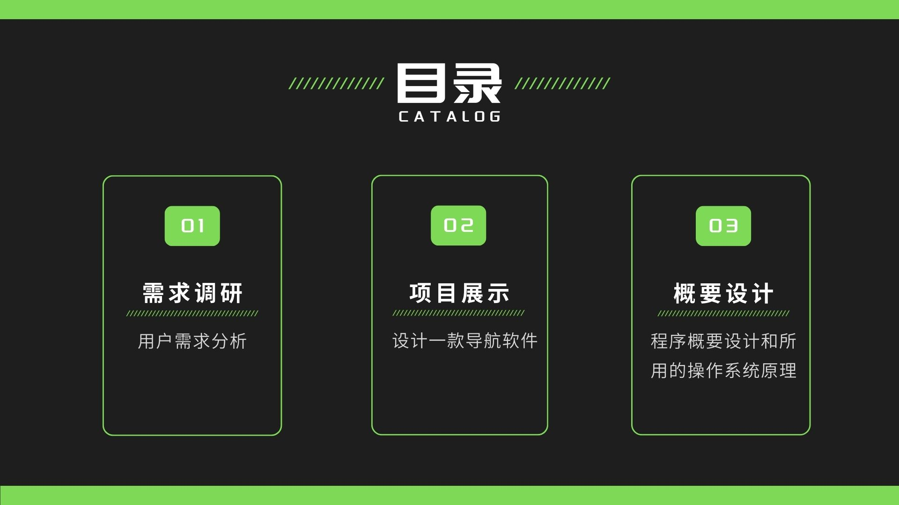 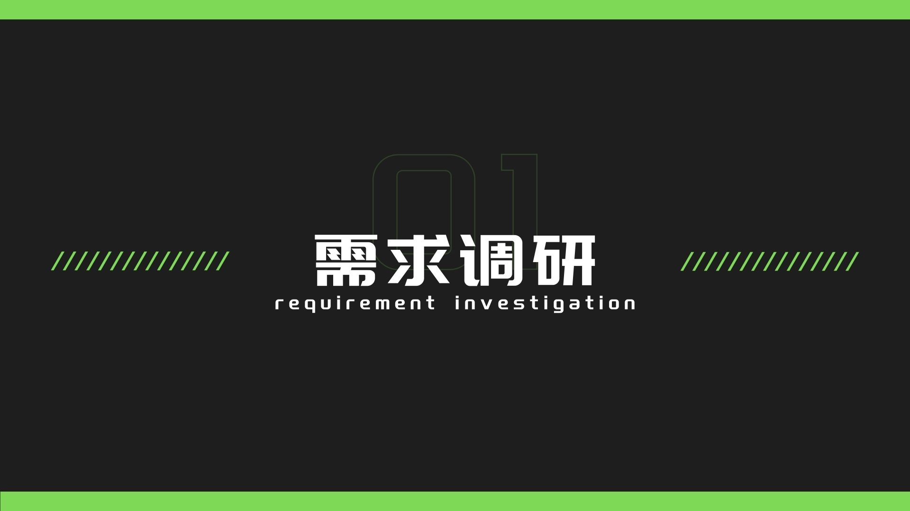 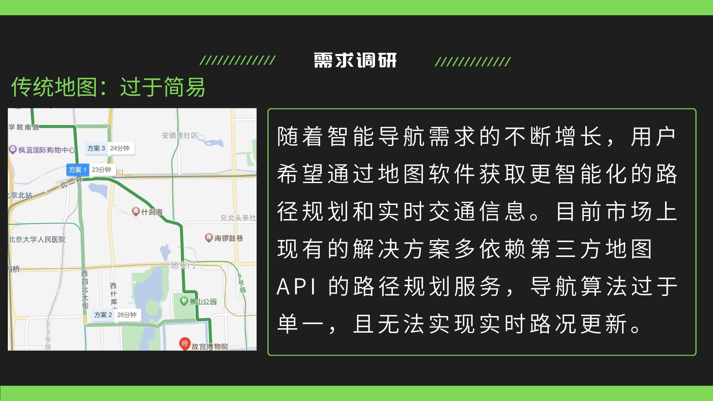  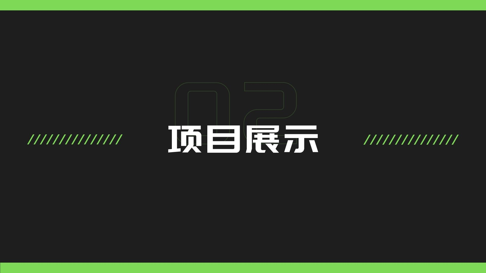 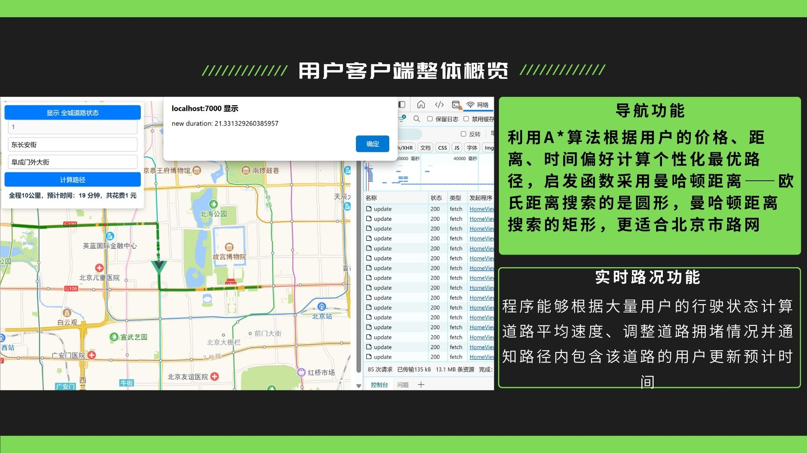 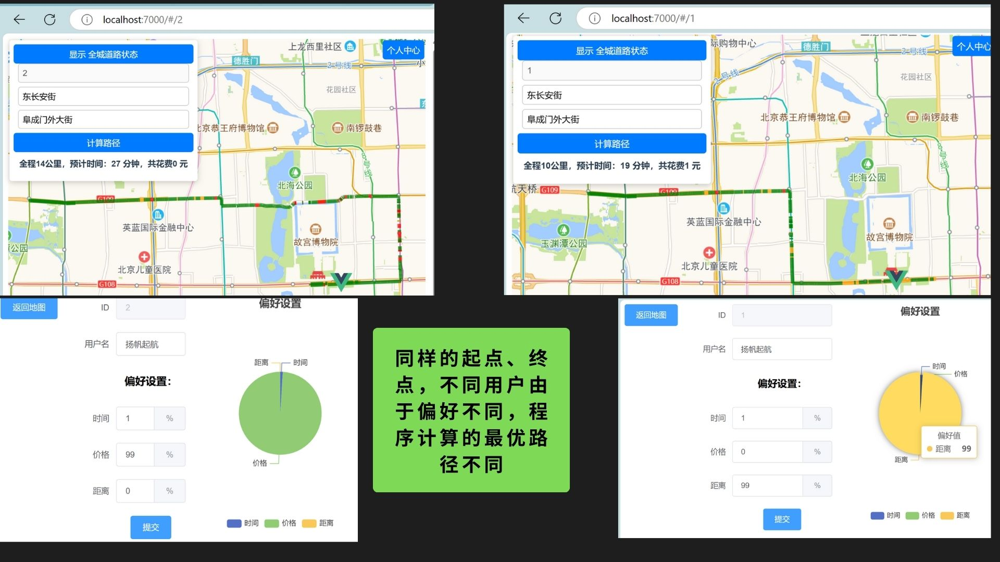  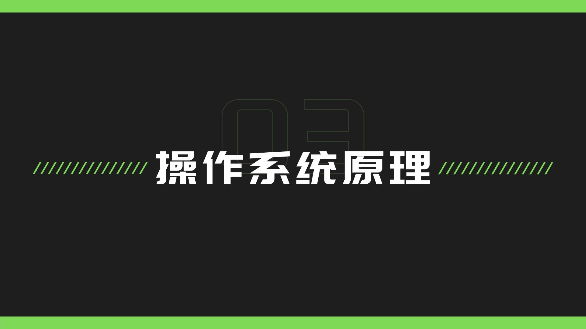 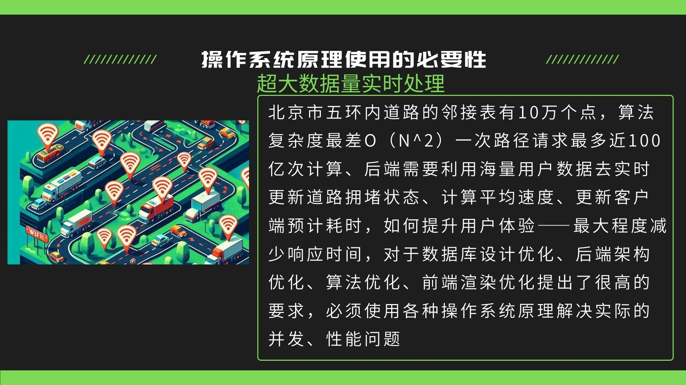 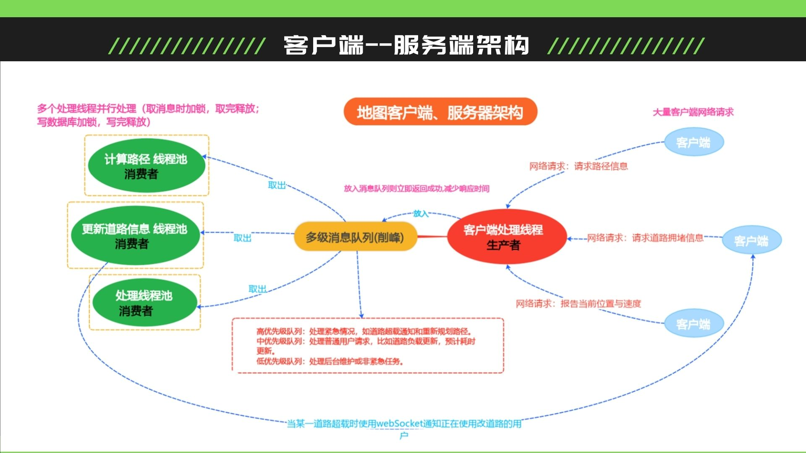 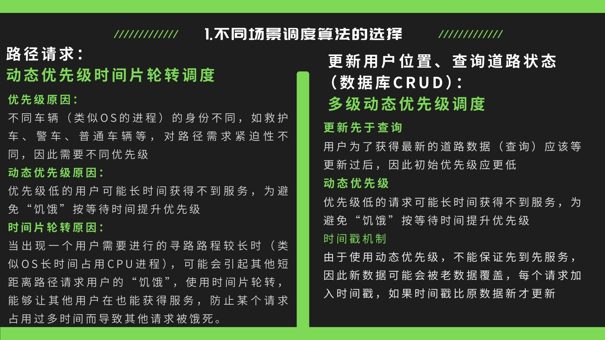 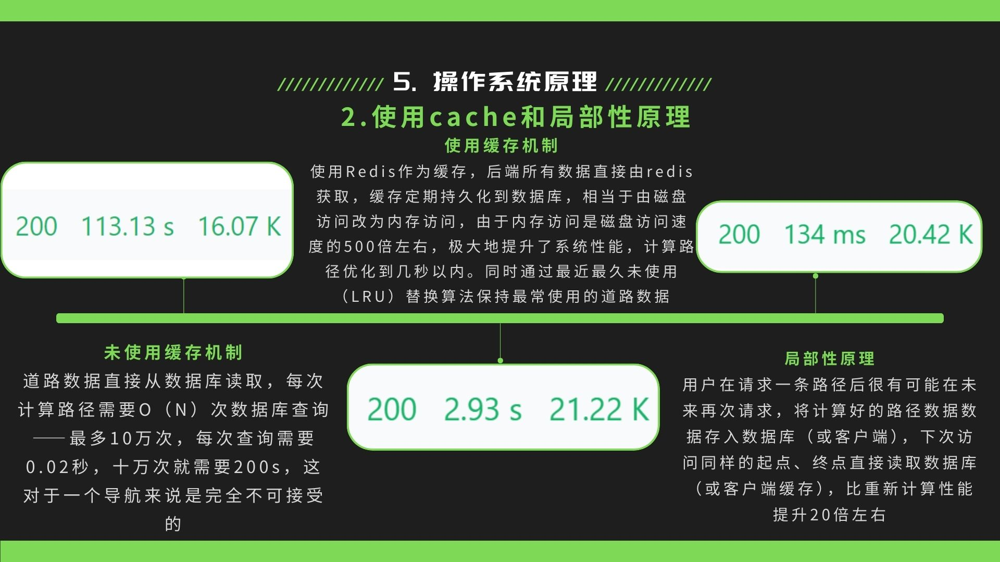 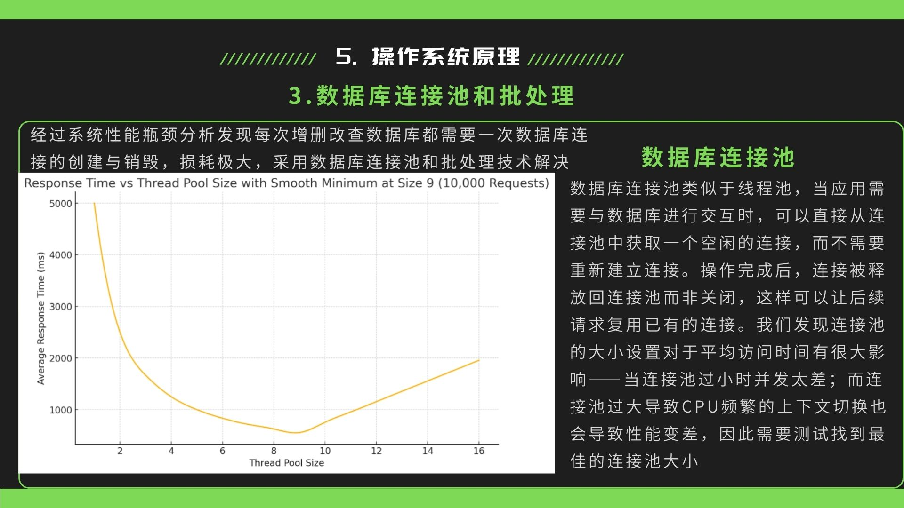 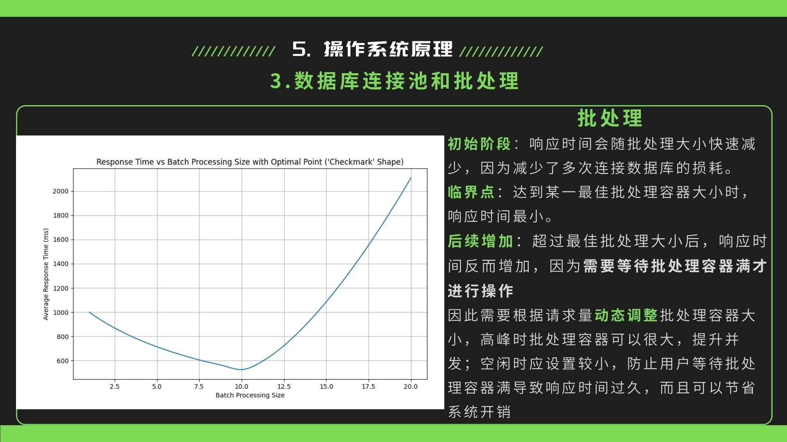 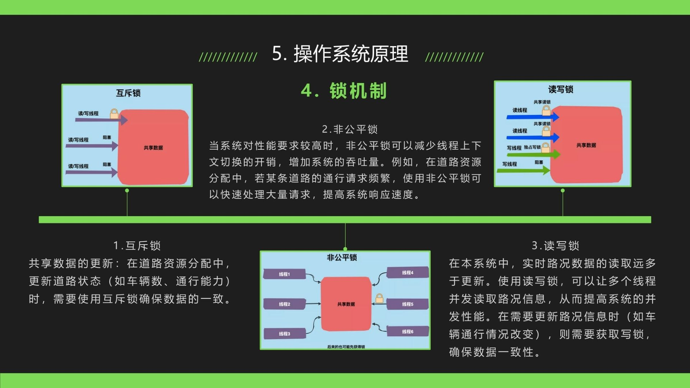 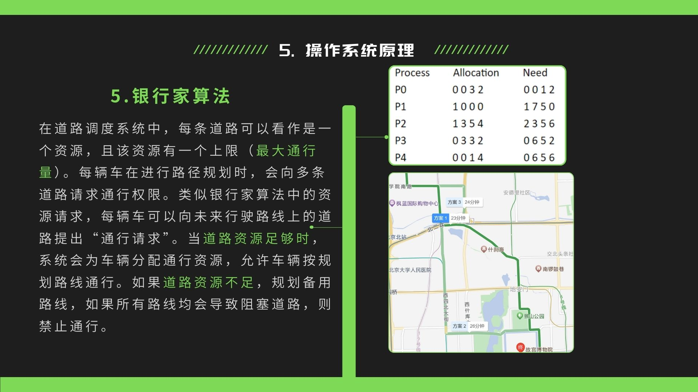 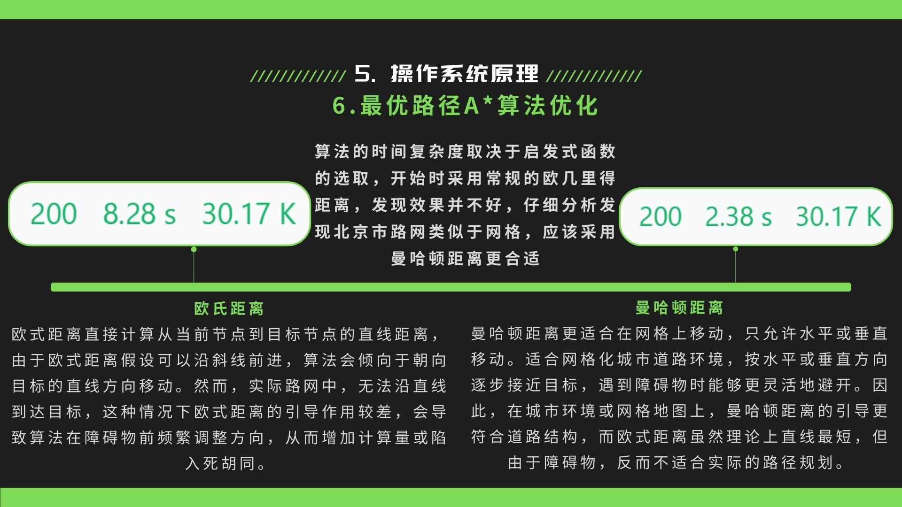 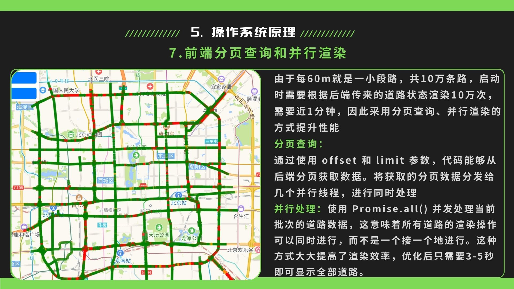 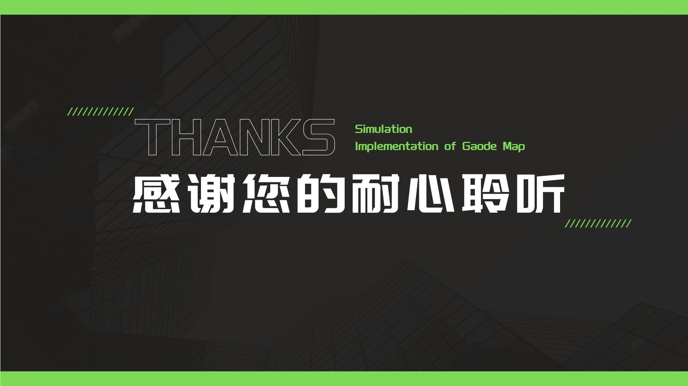
